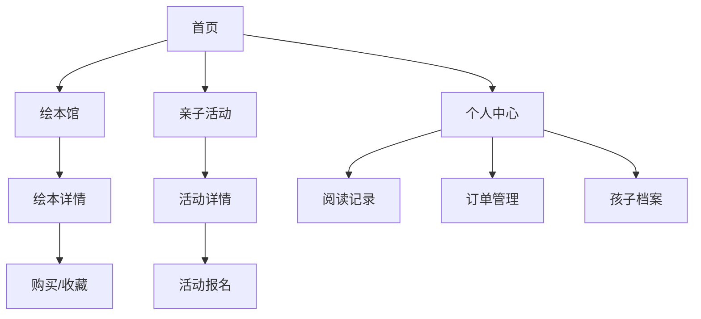

## 1. 产品概述

绘本岛（HuibenDAO）是一个专为亲子家庭设计的绘本阅读与亲子活动平台。通过提供丰富的绘本资源和线下亲子活动，帮助家长培养孩子的阅读兴趣，增进亲子关系，打造温馨的亲子共读时光。

产品致力于解决中国家庭在亲子阅读中遇到的绘本选择困难、缺乏亲子互动活动等问题，为0-6岁孩子的家庭提供一站式绘本阅读解决方案。

## 2. 核心功能

### 2.1 用户角色

| 角色 | 注册方式 | 核心权限 |
|------|----------|----------|
| 家长用户 | 手机号/微信注册 | 浏览绘本、购买借阅、报名活动、管理订单 |
| 孩子用户 | 家长账号下添加 | 阅读记录、打卡签到、收藏绘本 |
| 平台管理员 | 后台创建 | 内容管理、活动审核、用户管理 |

### 2.2 功能模块

绘本岛平台包含以下核心页面：
1. **首页**：轮播推荐、热门绘本、精选活动
2. **绘本馆**：分类浏览、年龄筛选、主题搜索
3. **绘本详情**：图书信息、用户评价、收藏购买
4. **亲子活动**：活动列表、报名参与、地区筛选
5. **阅读记录**：阅读足迹、打卡签到、读后感分享
6. **个人中心**：孩子档案、订单管理、客服支持
7. **注册登录**：多种登录方式、个人信息完善

### 2.3 页面详情

| 页面名称 | 模块名称 | 功能描述 |
|-----------|-------------|-------------|
| 首页 | 轮播图模块 | 展示精选绘本和活动，支持自动轮播和手动切换 |
| 首页 | 热门绘本 | 展示当前最受欢迎的绘本，支持点击查看详情 |
| 首页 | 活动推荐 | 推荐优质亲子活动，显示活动时间和报名人数 |
| 绘本馆 | 分类导航 | 按年龄、主题、类型分类展示绘本 |
| 绘本馆 | 筛选器 | 支持多维度筛选：年龄段、主题类型、价格区间 |
| 绘本馆 | 搜索功能 | 支持关键词搜索，智能联想和热门搜索 |
| 绘本详情 | 图书信息 | 展示封面、标题、作者、出版社、适读年龄 |
| 绘本详情 | 简介内容 | 详细内容介绍、教育意义、亲子共读建议 |
| 绘本详情 | 用户评论 | 展示其他用户评价，支持点赞和回复 |
| 绘本详情 | 收藏购买 | 支持加入收藏、立即购买、加入购物车 |
| 亲子活动 | 活动列表 | 展示所有活动，支持地区筛选和时间排序 |
| 亲子活动 | 活动详情 | 活动时间、地点、费用、报名要求、剩余名额 |
| 亲子活动 | 报名功能 | 支持在线报名、支付费用、查看报名状态 |
| 阅读记录 | 阅读足迹 | 记录已读绘本、阅读时长、阅读进度 |
| 阅读记录 | 打卡签到 | 每日阅读打卡，连续签到奖励机制 |
| 阅读记录 | 读后感 | 支持文字、图片、语音形式的读后感分享 |
| 个人中心 | 孩子档案 | 管理孩子信息、年龄段、阅读偏好 |
| 个人中心 | 订单管理 | 查看购买记录、借阅状态、物流信息 |
| 个人中心 | 客服支持 | 在线客服、常见问题、意见反馈 |
| 注册登录 | 登录方式 | 支持手机号、微信、一键登录 |
| 注册登录 | 信息完善 | 填写基本信息、孩子信息、阅读偏好 |

## 3. 核心流程

### 用户主要操作流程：
1. **新用户注册流程**：选择注册方式 → 填写基本信息 → 完善孩子档案 → 进入首页
2. **绘本浏览购买流程**：浏览绘本 → 查看详情 → 加入收藏/购物车 → 结算支付 → 订单管理
3. **活动报名流程**：浏览活动 → 查看详情 → 选择参与人数 → 填写信息 → 支付费用 → 报名成功
4. **阅读记录流程**：阅读绘本 → 打卡签到 → 记录读后感 → 分享成就

## 4. 用户界面设计

### 4.1 设计规范

**品牌色彩**：
- 主色调：米白色 (#FAF8F3) - 营造温馨舒适的阅读氛围
- 辅助色：淡黄色 (#FFF8DC) - 代表阳光和温暖
- 强调色：天蓝色 (#87CEEB) - 象征想象力和创造力
- 文字色：深棕色 (#4A4A4A) - 保证良好的阅读体验

**视觉元素**：
- Logo设计：绘本变成小岛的形状，岛上长出一棵树，寓意知识的岛屿
- 按钮样式：圆角矩形设计，增加亲和力
- 字体选择：思源黑体为主，保证中文显示效果
- 图标风格：手绘风格，富有童趣和温度

**布局风格**：
- 卡片式布局，信息层次清晰
- 底部导航栏，便于单手操作
- 留白充足，减少视觉疲劳

### 4.2 页面设计

| 页面名称 | 模块名称 | UI设计要点 |
|-----------|-------------|-------------|
| 首页 | 轮播图 | 全屏宽度，渐变过渡动画，支持手势滑动 |
| 首页 | 绘本推荐 | 网格布局，每行2-3个，显示封面和标题 |
| 绘本馆 | 分类导航 | 顶部标签页，图标+文字，支持横向滑动 |
| 绘本馆 | 筛选器 | 抽屉式弹出，多选条件，一键清空 |
| 绘本详情 | 图书封面 | 大图展示，支持放大查看，3D翻页效果 |
| 绘本详情 | 购买按钮 | 底部固定，醒目颜色，一键购买 |
| 亲子活动 | 活动卡片 | 左图右文，显示关键信息，报名状态标签 |
| 阅读记录 | 时间轴 | 垂直时间轴展示阅读历程，支持月份筛选 |
| 个人中心 | 头像区域 | 圆形头像，背景渐变，显示会员等级 |

### 4.3 响应式设计

**移动端优先**：
- 基准设计为375px宽度（iPhone标准）
- 支持320px-768px范围内的自适应
- 触摸目标最小44px，保证操作便利性

**平板适配**：
- 768px以上显示更多内容列数
- 利用横屏优势展示更多信息
- 支持分屏浏览模式

**交互优化**：
- 支持左右滑动手势切换内容
- 下拉刷新、上拉加载更多
- 长按快速预览功能
- 双击点赞等快捷操作

## 5. 技术要求

### 5.1 基础技术
- **前端框架**：React 18 + TypeScript
- **样式方案**：Tailwind CSS + 自定义主题
- **状态管理**：React Context + useReducer
- **路由管理**：React Router v6

### 5.2 第三方服务
- **支付集成**：微信支付、支付宝支付SDK
- **地图服务**：高德地图API（活动定位）
- **推送服务**：极光推送（活动提醒）
- **统计服务**：百度统计、友盟统计

### 5.3 性能要求
- 首屏加载时间 < 3秒
- 页面切换动画流畅，无卡顿
- 图片懒加载，支持WebP格式
- 离线缓存核心功能

### 5.4 安全要求
- HTTPS全站加密
- 用户数据本地加密存储
- 支付信息符合PCI DSS标准
- 隐私政策符合GDPR要求

## 6. 运营需求

### 6.1 内容管理
- 绘本信息后台管理系统
- 活动发布和审核流程
- 用户评论内容审核机制
- 热门内容推荐算法

### 6.2 用户增长
- 邀请好友奖励机制
- 新用户专享优惠
- 节日主题活动策划
- 社交媒体分享功能

### 6.3 数据分析
- 用户行为数据收集
- 阅读偏好分析报告
- 活动参与数据统计
- 商业转化漏斗分析